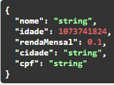
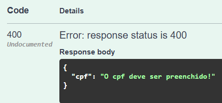
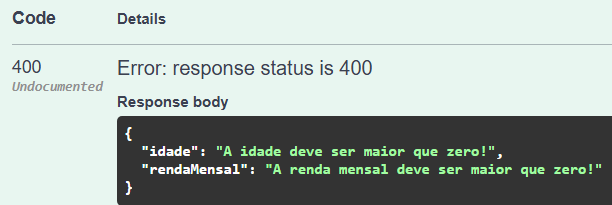

# Projeto de análises de crédito

Este projeto tem como objetivo realizar as análises de crédito e fazer o gerenciamento delas.
## Requisitos

Antes de começar, você precisará de:

* Java 17 (ou superior)
* Maven (para gerenciar dependências e executar o projeto)
* IDE recomendada: IntelliJ IDEA (mas outras IDEs também funcionam)

## Como Configurar o Projeto

### 1. Clonando o Repositório

Primeiro, clone o repositório do projeto para o seu ambiente local:

`git clone https://github.com/ErikKenzoValle/credit-scores.git
`

`cd credit-scores
`

### 2. Configurando o Ambiente
Se você estiver usando IntelliJ IDEA, basta abrir o projeto na IDE, a configuração será feita automática.

Caso não tenha o IntelliJ IDEA:

Faça o download e instale a versão mais recente do [IntelliJ IDEA](https://www.jetbrains.com/idea/download/).

Abra o IntelliJ IDEA e selecione "Open" e escolha o diretório do projeto.

### 3. Configurando Dependências
As dependências podem ser baixadas automaticamente ao abrir o projeto no IntelliJ IDEA, ou você pode rodar o seguinte comando no terminal:

`
mvn clean install
`

## Como Rodar o Projeto

### 1. Executando o Projeto

Com as dependências configuradas, você pode rodar o projeto da seguinte maneira:

Dentro do IntelliJ IDEA, você pode simplesmente rodar a classe principal, que está em `src/main/java/com/erik/creditscores/CreditScoresApplication.java`. Você pode clicar com o botão direito e escolher a opção Run 'ContactsManagerApplication', é um botão play verde.

Ou pelo terminal:

`mvn spring-boot:run`

### 2. Acessar o Swagger
Para testar os endpoints, acesse o Swagger, uma interface de fácil uso, através do link: http://localhost:8080/swagger-ui/index.html

## Como Rodar os Testes

Para rodar os testes unitários, você pode usar o Maven diretamente pela IDE ou pelo terminal:

#### Pelo IntelliJ IDEA:

Clique com o botão direito na pasta `src/test/java` e selecione Run 'All Tests'.

#### Pelo terminal:

Rodar todos os testes do projeto:

`mvn test`

Ou para rodar um teste específico:

`mvn -Dtest=NomeDaClasseTeste test`

## Documentação técnica

### Endpoints

1. POST /v1/credit-scores

Request body:

Todos os campos são obrigatórios, caso você não passe algum deles, será retornado 400 e uma mensagem de erro.

Caso seja colocado um valor negativo ou 0 na renda mensal ou na idade, também será retornado 400 e uma mensagem de erro.

O endpoint tem mapeado 2 outros cenários de erro, um em caso da API externa de clima retornar qualquer erro, e o outro em caso de ocorrer qualquer erro no endpoint, como no cálculo do score por exemplo.

2. GET /v1/credit-scores/{cpf}

Endpoint que retorna todas as análises de crédito de um usuário, passado seu CPF. Não há nenhuma validação no endpoint, então se for digitado um CPF inválido, ele irá retornar status 200 e vazio. Caso não ache nenhuma análise de crédito para um CPF válido, irá também retornar status 200 e vazio.
